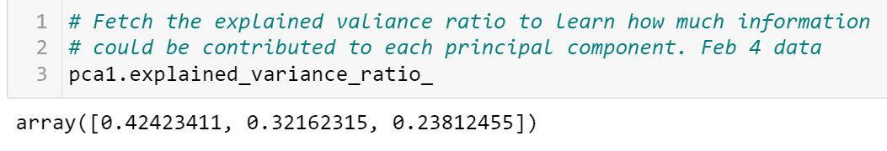
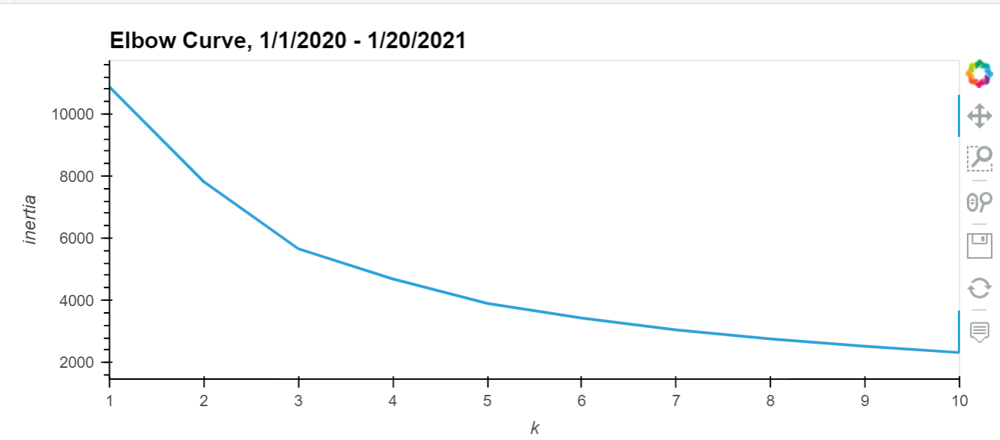

# Guide to the csv files created for the presentation

I call the stock closing price on Jan 1, 2020 as the "Reference zero". This is the _start date_

Column guide that could be useful:
- Adj Close = Adjusted close stock price for the day. There is only a small variation in some stocks. 
- ref_Close = Cumulative stock price adjusted to the closing price on Jan 1, 2020.
- Perc_ref = Cumulative % change of the stock price compared to the Adjusted closing price on Jan 01, 2020.
- Perc_Change = daily percent change of the stock price.

## 1. All twelve stocks analysis

The csv file is: *stocks_12.csv* ; the dataframe is "combined_all" in the file *preprocess_all_stocks_v2.ipynb*. The useful plots from this file are:

**Fig 1** The data frame with all the files

**Fig 2** Cumulative % change of stock closing price change from Jan 1, 2020. This file contains all 12 stocks. Here, y='Perc_ref'. This figure **includes NASDAQ**. Use the file, **stocks_12.csv** to make this image.

**Fig 3** Cumulative % change of stock closing price change from Jan 1, 2020. This file contains all 12 stocks. Here, y='Perc_ref'. This figure **DOESE NOT include NASDAQ**. Use the file, **stocks_11_Jan2020.csv** to make this image.

**Fig 4** Cumulative change in the stock price adjusted to Jan 20, 2020. **This does not include NASDAQ**. Use the file, **stocks_11_Jan2020.csv** to make this image.

### **2.  Files with PCA analysis**
#### **PCA analysis with 11 stocks, 1/1/2020 until 10/28/2021**

The columns used for PCA are "Volume", "Net_Close", "Net_High", "Net_Low", K=6 clusters. 

**Fig 5** The dataframe showing all 11 stocks, PCA analysis, K=6. The fitting was on "Volume", "Net_Close", "Net_High", "Net_Low", K=6 clusters. The CSV file that goes with this dataframe is *stocks_11_PCA_Class6*.

**Fig 6** The elbow curve. The PCA fit was done on four columns listed above. The time is from 1/1/2020 until 10/28/2021. 

**Fig 7** A 3D plot of the three PCA values of the clusters. Note that the GME stock price on Jan 28, 2021 is a class by itself. Here *hover_name* = "Ticker", color="class", *hover_data* = ["Date", "High"]. The data is in file: *Resources/stocks_11_PCA_Class6.csv* .

**Fig 8** This is a plot of the same clusters. The points are colored by the Tickers. All the information is the same as in Fig 7. The only difference is that this one has color="Ticker" and "hover_name"="Class". 

### **PCA Analysis After Feb 4**

PCA Analysis on stocks after the "GME explosion". 

**Fig 9** The Explained variance ratio of the stock price change after the explosion.

**Fig 10** The elbow curve of the PCA analysis of the price change after the explosion.

**Fig 11** The PCA clusters of the change in stock price since the GME explosion, starting from Feb 4, 2021. The plot is made from the csv file:"Resources/Feb4_PCA_K4.csv". The hover data, color are similar to Fig 7. 

**Fig 12** The PCA clusters of the change in stock price after the GME explosion, starting from Feb 4, 2021. The color is the stock ticker. The plot is made from the csv file:"Resources/Feb4_PCA_K4.csv". The hover data, color are similar to Fig 8.

**Fig 13** The elbow curve of the PCA analysis of the price change before the explosion.

**Fig 14** The PCA clusters of the change in stock price before the GME explosion, starting from Jan 1 2020 until Jan 21, 2021. The plot is made from the csv file:"Resources/Jan1_PCA_K5.csv". The hover data, color are similar to Fig 7. 

**Fig 14** The PCA clusters of the change in stock price before the GME explosion, starting from Jan 1 2020 until Jan 21, 2021. The plot is made from the csv file:"Resources/Jan1_PCA_K5.csv". The hover data, color are similar to Fig 8. 

## To be continued with before and after comparison.......