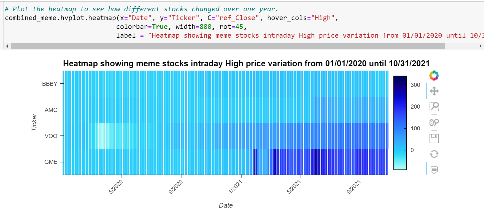
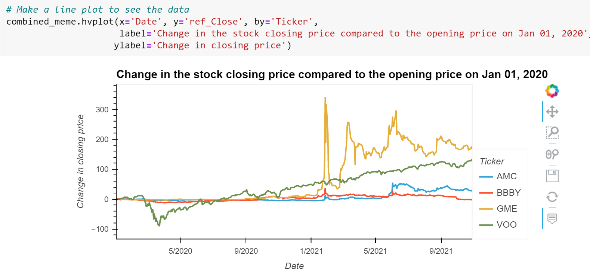
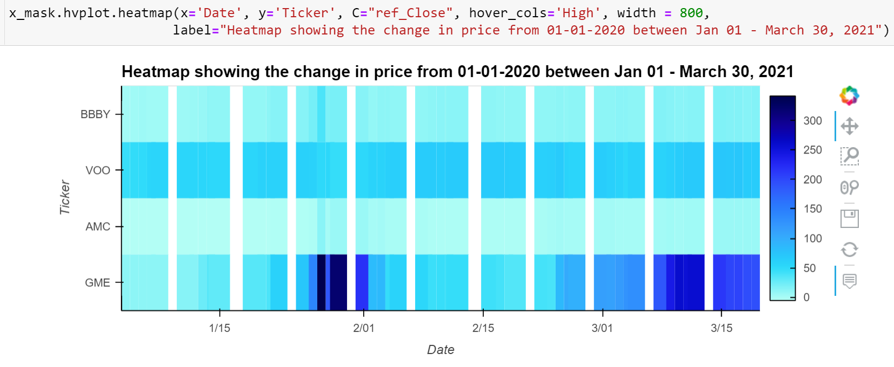
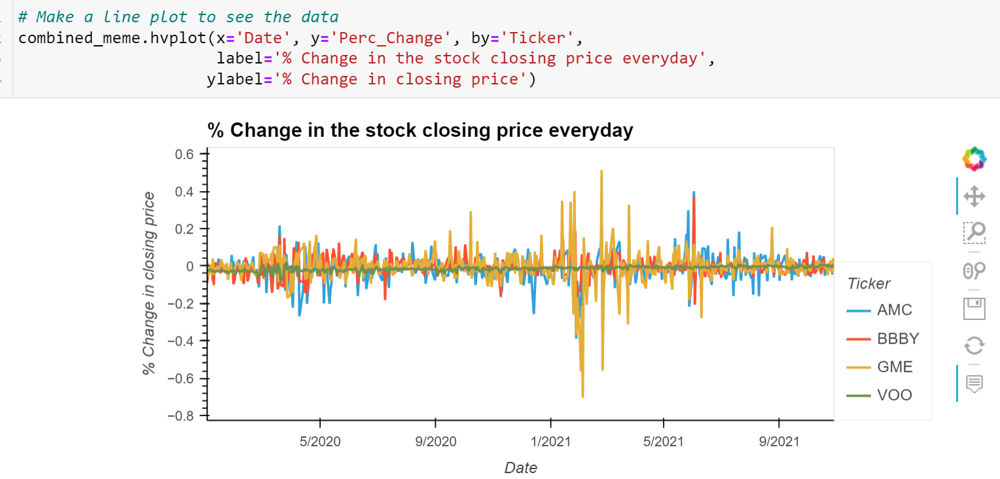
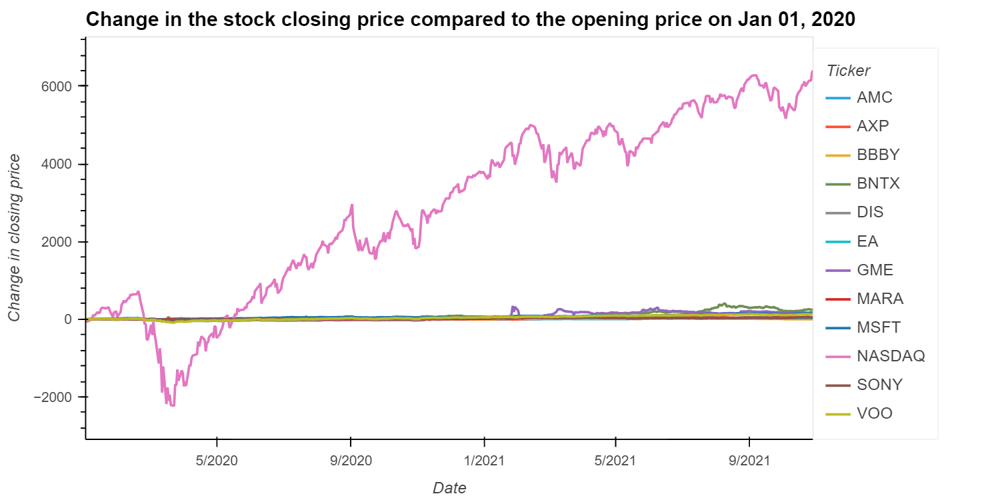
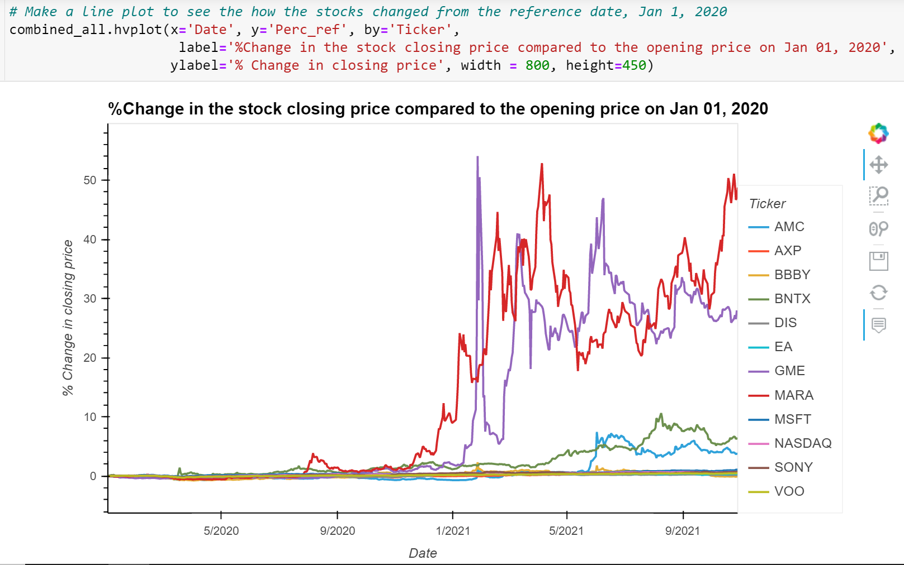
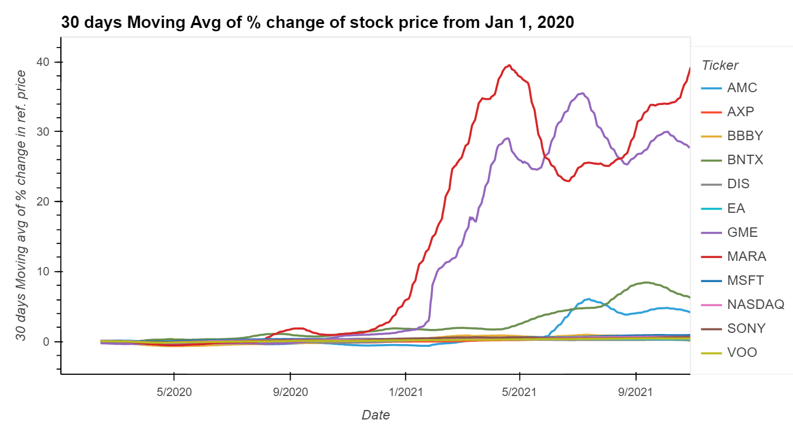

## **Notes on Nov 25 Analysis**

### **Summary**

I used the final data for analysing data in this part of the project. The data source is **_Yahoo Finance_** . There are twelve stocks: Gamestop (GME), AMC Entertainment Holdings (AMC), Bed Bath and Beyond (BBBY), American Express (AXP), Microsoft Corporation (MSFT), The Walt Disney Company (DIS), BioNTech (BNTX), Marathon Digital Holdings Inc (MARA), Electronics Art Inc (EA), Sony Group Corporation (SONY), Vanguard S & P 500 ETF (VOO) and Nasdaq Composite(^IXIC). The stock prices are tracked from Jan 01, 2020 until Oct 29, 2021.

### **Analysis** (In progress)

The meme stocks: GME, AMC, BBBY and VOO (index fund).

**Fig 1:** Meme stocks plus indext fund VOO

The meme stocks line plot

**Fig 2:** Meme stock price change compared to the closing price on Jan 01, 2020. 

**Fig 3:** Meme stock price for a shorter period change. 

**Fig 4:** Intra-day percent change of the meme stock price.

### **All twelve stocks**

**Fig 5:** All stocks price change with respect to the price on Jan 01, 2020. 

**Fig 6:** The percent of the price change compared to the price on Jan 01, 2020 for all the stocks.

**Fig 7:** The 30 day moving average of % change of the stock price compared to the Jan 01, 2020 closing price.
